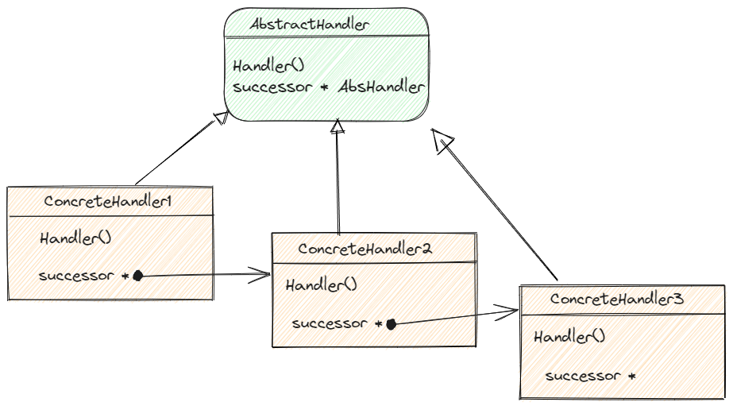

# Chain of Responsibility
## intention
多个对象都有机会处理请求，避免发送者与接收者之间的耦合关系
将对象连为一条链，请求延链条传递
## 适用性
- 多个对象可以处理一个请求
- 不明确指定接收者
- 接收者们需要动态组合

## 缺点
- 不保证接收
- 中间信息或错误处理困难

## 场景： 
Web拦截处理链： 信息过滤、鉴权、
AOP面向切面编程
```java
/**
 * Spring MVC中 HandlerExecutionChain
SpringMVC中实际上是基于Servlet的框架，当客户端发送请求到web时，都会进入DispatcherServlet中，然后根据Servlet的生命周期去执行doService方法，在doService方法中有一个关键方法doDispatch
 */

void doDispatch(HttpServletRequest request, HttpServletResponse response)  {
    HandlerExecutionChain mappedHandler = getHandler(request);
    if (!mappedHandler.applyPreHandle(request, response)) {
        return;
    }
    ModelAndView mv = executeHandler(request, response, mappedHandler);
    …………………………
    mappedHandler.applyPostHandle(request, response, mv);
    processDispatchResult(request, response, mappedHandler, mv, null);
}

//HandlerExecutionChain的applyPreHandle方法
//责任链模式，将处理对象给接收者，并不关心内部如何处理与调用
boolean applyPreHandle(HttpServletRequest request, HttpServletResponse response) {
        for (int i = 0; i < this.interceptorList.size(); i++) {
            HandlerInterceptor interceptor = this.interceptorList.get(i);
            //调用拦截器的preHandle方法，执行所有拦截器的preHandle处理方法
            if (!interceptor.preHandle(request, response, this.handler)) {
                triggerAfterCompletion(request, response, null);
                return false;
        }
            this.interceptorIndex = i;
        }
        return true;
}

@Aspect
public class LoggingAspect {
    @Before("execution(* com.example.service.*.*(..))")
    public void logBefore(JoinPoint joinPoint) {
        // 执行前的日志记录逻辑
    }

    @After("execution(* com.example.service.commit.*(..))")
    public void logAfter(JoinPoint joinPoint){...}
}

```


Weinand A, Gamma E, Marty R. ET++—an object oriented application framework in C++[J]. ACM Sigplan Notices, 1988, 23(11): 46-57.
事件处理者




doDispatch 方法的实现是 Spring MVC 请求处理流程中非常关键的一环，它协调了请求的各个阶段，包括拦截器的执行、处理器的调用、视图的渲染以及异常处理，确保请求能够正确地被处理和响应。

org.springframework.web.servlet.DispatcherServlet.java
org.apache.catalina.core.ApplicationDispatcher.java
ApplicationFilterChain